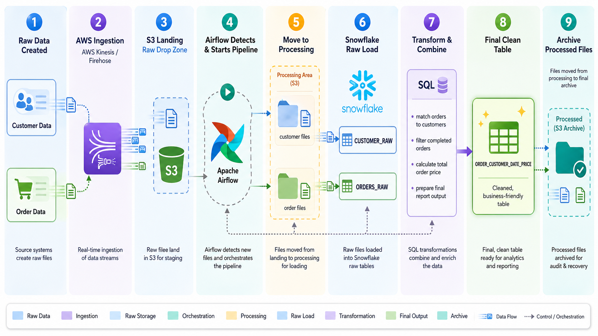
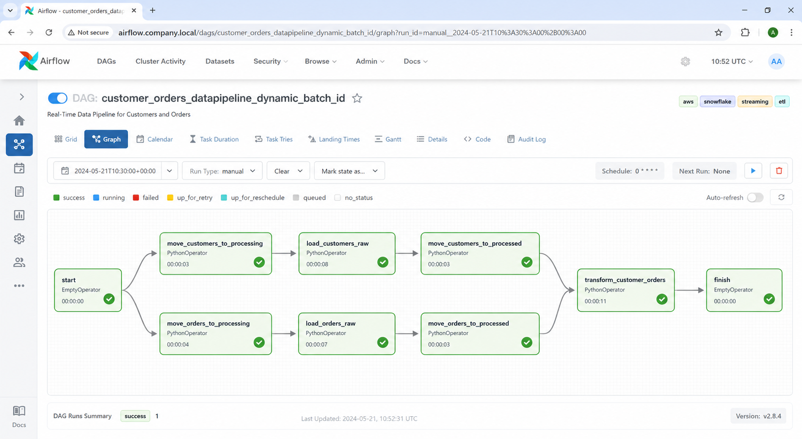
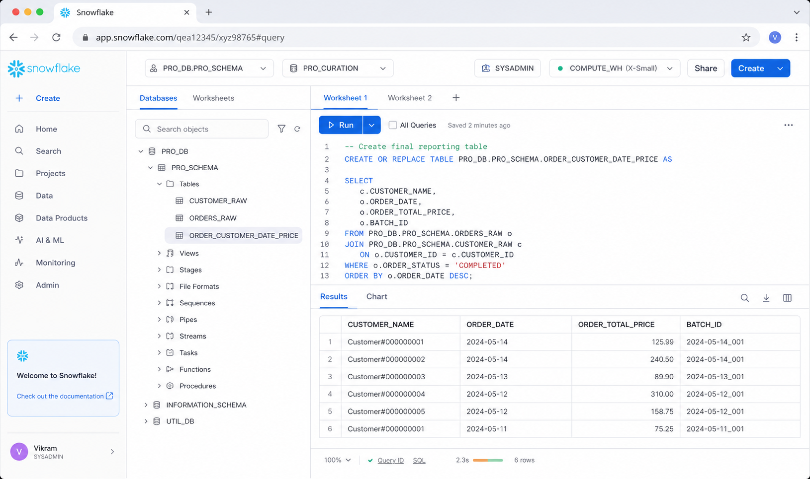

# Retail Sales Data Preparation Pipeline

This repository contains an AWS Kinesis, S3, Airflow, and Snowflake pipeline for moving raw customer and order data into a final reporting table.

## Overview

The project implements a straightforward data engineering workflow:

1. ingest raw files through AWS streaming infrastructure
2. stage and move files across S3 zones with Airflow
3. load the raw records into Snowflake
4. create a final table for downstream reporting

The repository is intentionally focused on the pipeline logic. It does not include full infrastructure provisioning, monitoring, or a dashboard layer.

## What The Pipeline Does

The Airflow DAG handles two datasets:

- `customers`
- `orders`

For each run, the pipeline:

- moves files from `landing/` to `processing/` in S3
- loads customer and order files into Snowflake raw tables
- moves processed files from `processing/` to `processed/`
- builds a joined summary table named `ORDER_CUSTOMER_DATE_PRICE`

Each run is tagged with a batch identifier derived from the Airflow execution timestamp.

## Architecture



The image above shows the flow from raw input to final reporting output.

### Simple Step-By-Step Flow

1. Raw customer data and order data are created by the source systems.
2. AWS Kinesis / Firehose ingests those incoming data streams.
3. The files land in Amazon S3 in the raw landing zone.
4. Apache Airflow detects the new files and starts the pipeline.
5. Airflow moves the files from `landing` to `processing`.
6. Snowflake loads the files into the raw tables:
   `CUSTOMER_RAW` and `ORDERS_RAW`.
7. SQL transformations join and clean the raw data.
8. The final analytics table `ORDER_CUSTOMER_DATE_PRICE` is created for reporting.
9. After the run finishes, the files are moved into the processed archive.

### How To Read The Architecture

- left side: raw customer and order files begin the pipeline
- middle: AWS and Airflow handle ingestion, staging, and orchestration
- right side: Snowflake loads, transforms, and creates the final reporting table
- last step: processed files are archived for audit and recovery

## Pipeline Screens

The following screenshots are illustrative mockups based on the pipeline structure implemented in this repository.

### Airflow DAG View



This view reflects the DAG structure in `customer_orders_datapipeline_dynamic_batch_id`, where customer and order branches run in parallel before converging on the final transform step.

### Snowflake Worksheet View



This view represents the Snowflake side of the project, where raw tables are loaded and transformed into the final reporting table `ORDER_CUSTOMER_DATE_PRICE`.

## Repository Structure

```text
Retail-Sales-Data-Preparation-Pipeline/
├── dags/
│   └── customer_orders_pipeline.py
├── sql/
│   └── snowflake_setup.sql
├── assets/
│   ├── airflow-ui-mock.png
│   ├── architecture-overview.png
│   └── snowflake-ui-mock.png
├── requirements.txt
├── .gitignore
└── README.md
```

## Key Files

### `dags/customer_orders_pipeline.py`

The Airflow DAG that:

- moves files between S3 zones with `aws s3 mv`
- runs Snowflake `COPY INTO` commands
- executes a downstream SQL transformation

### `sql/snowflake_setup.sql`

Setup SQL for:

- storage integration
- Snowflake stages
- raw tables
- the final transformed table

## Airflow Flow

The DAG contains these main stages:

1. move customer files from S3 landing to processing
2. move order files from S3 landing to processing
3. load `CUSTOMER_RAW`
4. load `ORDERS_RAW`
5. move both datasets to the processed zone
6. create a joined customer-order summary in Snowflake

The customer and order branches run in parallel until the final transform step, which depends on both raw tables being loaded.

## Snowflake Output

The final table created by the transformation step is:

- `ORDER_CUSTOMER_DATE_PRICE`

This table stores:

- `CUSTOMER_NAME`
- `ORDER_DATE`
- `ORDER_TOTAL_PRICE`
- `BATCH_ID`

It is a simple example of turning raw event-style data into a business-friendly reporting table.

## Configuration

The DAG reads configuration from environment variables when available:

- `SNOWFLAKE_CONN_ID`
- `PIPELINE_S3_BUCKET`
- `SNOWFLAKE_WAREHOUSE`
- `SNOWFLAKE_DATABASE`
- `SNOWFLAKE_SCHEMA`
- `SNOWFLAKE_ROLE`

If these are not set, the DAG falls back to the default values currently shown in the source file.

## Prerequisites

- AWS account with access to S3 and the streaming setup you want to use
- Airflow or MWAA environment
- Snowflake account
- AWS CLI available in the Airflow runtime

## Current Scope

This repository currently contains:

- the DAG logic
- the Snowflake setup SQL
- an architecture diagram
- illustrative Airflow and Snowflake screenshots

It does not currently include:

- Terraform or CloudFormation for infrastructure provisioning
- test suites
- CI/CD workflows
- a dashboard UI
- monitoring and alerting code
- production deployment scripts

## Notes For Reviewers

The strongest files to review first are:

- [dags/customer_orders_pipeline.py](/home/vikram/Downloads/Test_Github_repo_update/Real-Time-Data-Pipeline/dags/customer_orders_pipeline.py:1) for orchestration logic
- [sql/snowflake_setup.sql](/home/vikram/Downloads/Test_Github_repo_update/Real-Time-Data-Pipeline/sql/snowflake_setup.sql:1) for warehouse objects

## Next Steps

Reasonable next additions for this project would be:

1. add a small test suite for the DAG structure and transform logic
2. add Airflow and Snowflake screenshots from a real run
3. add infrastructure-as-code for the AWS resources
4. add data quality checks around the raw loads
